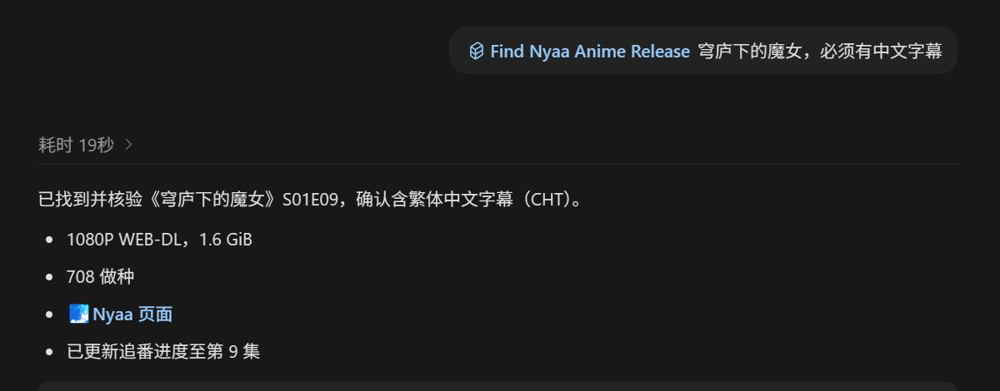
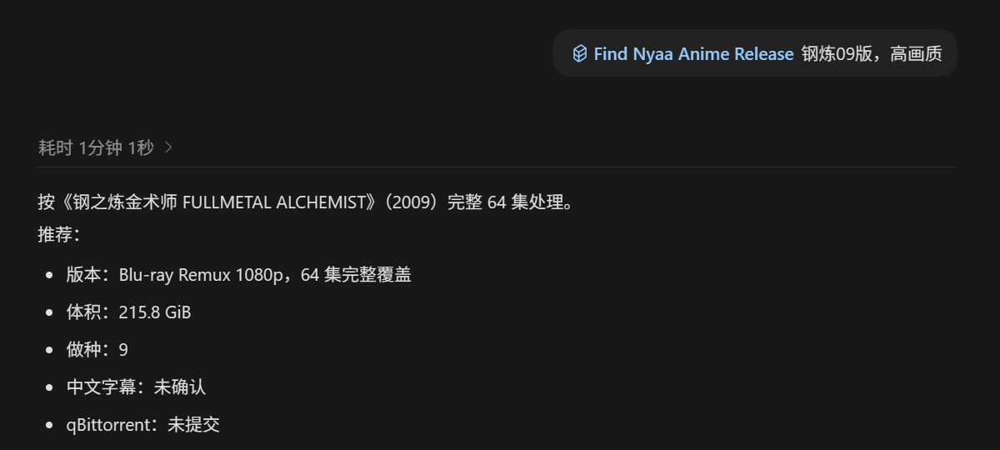
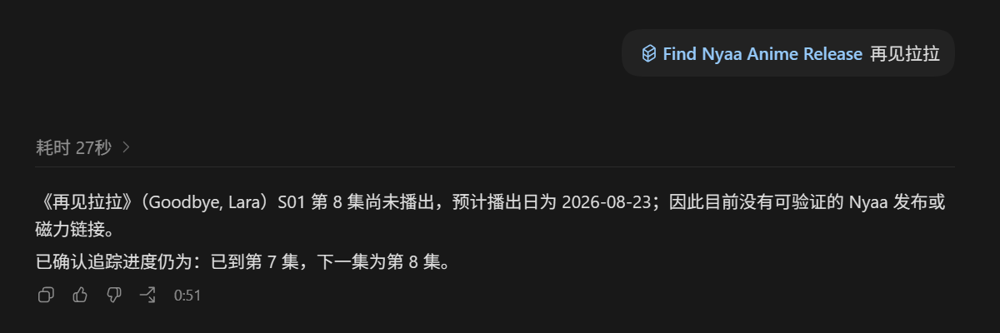
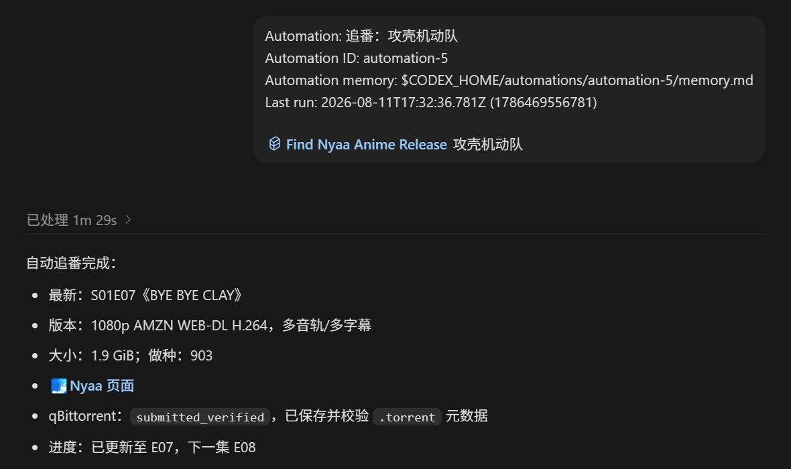
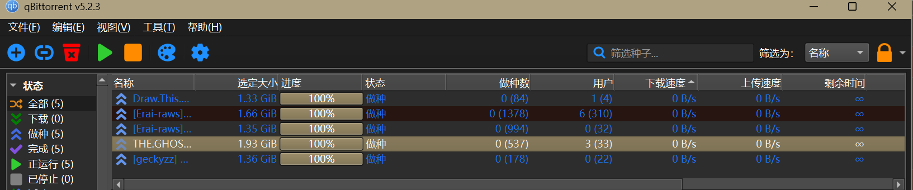
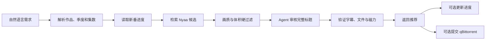

# Find Nyaa Anime Release

<p align="center">
  <strong>让 Codex 识别动画、筛选画质与字幕、记录新番进度，并返回经过验证的 Nyaa 发布。</strong>
</p>

<p align="center">
  
  
  
</p>



你只需要用自然语言说明动画、季度、集数、画质或字幕要求。Skill 会解析作品身份，比较 Nyaa 候选，检查季集、体积、字幕和磁力，再把合格结果交给你。

## 能做什么

- 识别中文名、简称、英文名和罗马字名，区分季度、正篇、特典、剧场版与合集。
- 支持最新一集、指定集、追番下一集、整季包和电影。
- 先执行作品、季集、画质和体积硬过滤，再比较活跃度与字幕信号。
- 默认偏好中文字幕；只有明确提出“必须有中文字幕”时才将其作为硬条件验证。
- 返回最终推荐前验证磁力，不把失败或不合格候选暴露给用户。
- 只为当前在播动画维护进度；老番、电影、特典和失败检索不会污染追番记录。
- 可选将最终结果提交到本机 qBittorrent，也可用于 Codex 定时追番任务。

## 安装

在 Codex 中运行：

```text
$skill-installer install https://github.com/divisioncassini05-lab/find-nyaa-anime-release/tree/main/skills/find-nyaa-anime-release
```

安装后新建一个 Codex 任务即可使用。

### 手动安装

1. 下载本仓库 ZIP 并解压。
2. 将 `skills/find-nyaa-anime-release` 整个文件夹复制到：
   - Windows：`C:\Users\你的用户名\.codex\skills\find-nyaa-anime-release`
   - macOS / Linux：`~/.codex/skills/find-nyaa-anime-release`
3. 重新打开 Codex，或新建一个任务。

## 直接这样说

```text
$find-nyaa-anime-release Re0
$find-nyaa-anime-release 穹庐下的魔女，必须有中文字幕
$find-nyaa-anime-release 零之使魔第二季，高画质
$find-nyaa-anime-release clannd,全系列
$find-nyaa-anime-release 魔法少女小圆：叛逆的物语，高画质
$find-nyaa-anime-release 攻壳机动队，找到后提交 qBittorrent
```

不写季度或集数时，Skill 会结合作品身份和本地追番状态判断；存在真正歧义时才会询问。

## 画质档位

| 说法 | 默认范围 | 说明 |
| --- | ---: | --- |
| 轻量观看 / 随便看看 | 1–2 GiB/集 | 绝对下限 1 GiB，约 1.5 GiB 优先 |
| 普通观看 / 一般画质 / 中等画质 | 2–4 GiB/集 | 找不到时按规则决定是否降一级 |
| 高画质 / 极致画质 / 最高画质 | ≥6 GiB/集 | 也接受 BDMV、Remux 或同级无损来源 |
| 电影 | ≥10 GiB 总大小 | 用户明确给出的范围优先 |

默认不会返回低于 `1 GiB/集` 的普通正篇。明确写出的体积范围是硬条件。如果有其他需求，如找不到1-2G，希望允许自动下调等需求，直接告诉ai就可以。

## 实际效果

### 整季与高画质

*注：为便于展示，截图裁去了下方的磁力链接；实际检索成功时会直接返回完整磁力链接。*
不会把任意单集或番外当成整季结果；整季包会检查覆盖范围和来源等级。



### 下一集尚未播出

目标集没播时会明确报告，并保留当前进度，不拿上一集冒充最新结果。



### 自动追番与下载

定时任务可以确认最新正篇、验证发布、提交 qBittorrent，再按结果更新下一集。





qBittorrent 提交是可选功能。普通搜索不要求安装 qBittorrent。

## 工作方式



脚本负责确定性的检索、解析和验证；Codex 负责阅读完整发布标题并判断作品版本、季度、正篇/特典以及最终候选。

## 追番规则

- 仅当前在播的 TV、短篇 TV 或 ONA 会进入追番状态。
- 成功返回严格更新的正篇后，下一次只说动画名即可继续找下一集。
- 指定旧集、重复集、电影、整季包和特典都不会推进观看进度。
- 下一集未播、网络失败、身份不明确或资源不合格时不会错误推进。
- 默认状态文件位于 `~/Downloads/Anime_Tracking/airing_watch_state.json`，可用 `ANIME_TRACKING_STATE` 指定其他位置。

## 运行条件

- Codex
- Python 3.10 或更高版本
- 能够访问 Nyaa 的网络环境
- qBittorrent 仅在启用自动提交时需要；该部分主要在 Windows 上测试

核心检索和追番脚本只使用 Python 标准库，不需要额外安装 Python 包。

## 测试

在仓库根目录运行：

```powershell
python -m unittest discover -s skills/find-nyaa-anime-release/tests -p "test_*.py"
```

## 使用边界

本项目与 Nyaa、OpenAI 和 qBittorrent 官方无关。请只检索和访问你依法有权获取的内容；使用者需要自行确认所在地区的法律与站点规则。

## License

[MIT](LICENSE)
